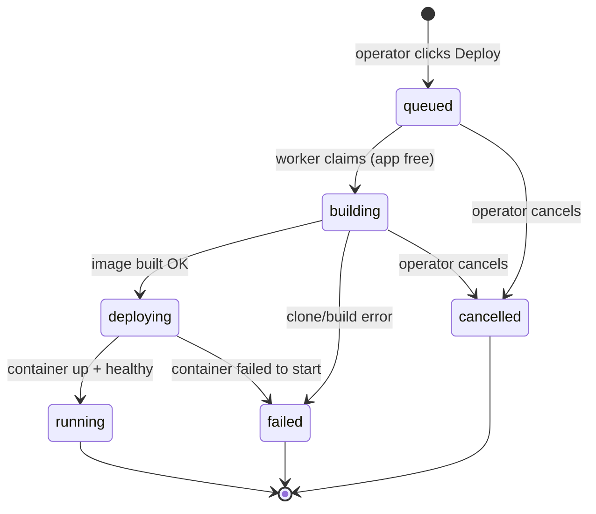

# Outhaul — Architecture

Outhaul is an open-source, self-hosted PaaS: a single Go binary plus SQLite that
turns a fresh VPS into a git-push-to-deploy platform by orchestrating Docker and
Traefik. It is positioned as a minimal alternative to Dokploy/Coolify — one
~22 MB binary, no Node, no Postgres, installed with `curl | sh`.

This document is the source of truth for the **locked architecture**, the
**package layout**, and the **deployment state machine**. Get the state machine
right here before writing the worker.

---

## Locked decisions (do not revisit)

- **Language/binary.** Go 1.24+, single module, single static binary. Web UI
  embedded via `embed.FS`. No JS build step, ever.
- **Storage.** SQLite via `modernc.org/sqlite` (pure Go, CGO stays off).
  Migrations embedded, run on startup. WAL mode.
- **Docker.** Official `github.com/docker/docker/client` SDK against the local
  socket. Never shell out to the `docker` CLI.
- **Reverse proxy.** Traefik, configured through the **Docker provider**
  (container labels), not the file provider. Outhaul starts and manages the
  Traefik container itself.
- **Builds.** Nixpacks initially (shell out to the `nixpacks` binary), abstracted
  behind a `Builder` interface so Dockerfile/buildpack strategies can be added.
- **HTTP.** `net/http` with stdlib 1.22+ routing patterns. No web framework.
  SSE for log/build streaming, not websockets.
- **Background jobs.** In-process worker with the `deployments` table as the
  queue. No external queue. Deploys for the same app serialize; different apps
  run concurrently.
- **Auth.** Single admin user for v1. argon2id password hash, session cookie.
  Created on first boot via a printed one-time setup URL.
- **Config.** Single `/var/lib/slipway/` data dir. Env-var overrides. No YAML.

### Milestone 1 scope (this session)

Thinnest end-to-end path: `slipway serve` → ensure Traefik container exists →
admin logs in → create an app (public Git URL + domain) → **Deploy** clones,
builds with Nixpacks, starts the container with correct Traefik labels, streams
build logs live to the browser via SSE → app reachable on its domain. Plus
`GET /healthz` and graceful shutdown that does not orphan a mid-flight deploy
(mark it failed on restart).

**Out of M1 (leave seams, don't build):** TLS/ACME, webhooks, GitHub App,
private repos, env-var management, multiple users/teams, databases-as-a-service,
metrics, multi-server.

### Milestone 2 (done)

TLS/ACME, env-var management, and app lifecycle (stop/restart/delete) — listed
above as out-of-scope for M1 — are now implemented. Still deferred: webhooks,
GitHub App, private repos, multiple users/teams, databases-as-a-service,
metrics, multi-server.

Design decisions from M2: env values are encrypted at rest with NaCl
`secretbox` and a local `secret.key`, and secrets are injected into the
runtime container only, never into the build. Deploys are health-gated — the
new container is polled before cutover, so a failed build never disrupts the
running app. App runtime state is derived from Docker rather than stored as a
desired-state column; the `unless-stopped` restart policy handles reboot.
HTTPS is Traefik + Let's Encrypt HTTP-01, enabled by setting
`OUTHAUL_ACME_EMAIL`, with a config-hash drift check that recreates the
Traefik container when its desired config changes.

### Milestone 3 (done)

Private repos and auto-deploy on push — listed above as deferred — are now
implemented. Still deferred: multiple users/teams, databases-as-a-service,
metrics, multi-server.

### Projects (done)

Apps are grouped into **projects** — Dokploy-style workspaces (a product, a
client) — via a `projects` table and an `apps.project_id` column. A `default`
project is created by migration and backfilled with existing apps, so app
creation never requires a project step first. Deliberate divergences from
Dokploy, argued in `docs/superpowers/specs/2026-07-04-projects-design.md`:
no organization layer (single-admin), no environment layer yet (a seam, the
same retrofit path Dokploy took), and project deletion is guarded rather than
cascading — a project must be emptied of apps before it can be deleted, since
deleting an app tears down a live container. Deployments and webhooks never
see a project; apps remain the deployable unit. There is no DB-level FK on
`apps.project_id` (SQLite can't add a `NOT NULL` FK column without a table
rebuild); the store enforces the reference instead.

Projects also hold **shared environment variables** (Dokploy's model, design
in `docs/superpowers/specs/2026-07-04-project-env.md`): a per-project
dictionary (`project_env`, encrypted at rest like `app_env`, edited from a
Shared variables panel on the project page) that apps opt into by writing
`${{project.KEY}}` inside their own env values. The worker resolves
references at deploy time in both pipelines (`core.ResolveEnv`): nothing is
injected unreferenced, a reference to an undefined shared variable fails the
deploy (never ship a literal placeholder), and a value that pulled in a
secret shared variable is treated as secret — kept out of the nixpacks build
env. Resolution is one level deep; changes apply on each app's next deploy.

### Docker Compose apps + watch paths (done)

Apps now carry a **kind** — `nixpacks` (the default; everything above) or
`compose` — chosen at creation. A compose app's repo ships a
`docker-compose.yml` (path configurable) and deploys as a whole stack by
shelling out to `docker compose` (v2 plugin, a new host requirement for
compose apps only) behind a `compose.Runner` interface with a fake, mirroring
the Nixpacks builder. The pipeline maps onto the same state machine:
`building` = clone + write `.env` (all env vars, for `${VAR}` interpolation,
Dokploy's layout) + `compose build`; `deploying` = `compose up -d --wait`
with the health timeout as the gate. **No blue-green for stacks** — compose
recreates containers in place (Dokploy behaves the same); the single-app
cutover is unchanged. Exposing a stack is opt-in and multi-domain (Dokploy's
model): a compose app has any number of `compose_domains` rows, each routing
one host to one service's container port, managed from a Domains panel on the
app page. The pipeline layers a generated `slipway.override.yml` over the
user's file (never rewriting it), attaching each published service to the
shared network and giving it one Traefik router per domain (named
`slipway-<app>-d<domainID>`, unique and stable) plus `traefik.docker.network`.
Domain edits apply on the next deploy, when the override is regenerated.
Lifecycle is label-based (`docker compose -p slipway-<name> stop|restart|down`)
so stop/restart/delete need no retained checkout; deletion keeps named
volumes. Raw pasted-YAML compose and Swarm mode are deferred (seams in
`docs/superpowers/specs/2026-07-04-compose-design.md`; multi-domain design in
`2026-07-04-compose-multidomain.md`).

**Watch paths** control *when* a push redeploys, for both kinds: per-app glob
patterns (`*`/`?` within a segment, `**` across, `[seq]`; a small built-in
matcher, no dependency) tested against the changed files a push webhook
reports. No patterns = every push to the branch deploys (unchanged default);
with patterns, a push that touches no matching file is skipped. A payload
carrying no file info fails open and deploys — not knowing what changed must
never silently drop a release (Dokploy crashes on that case; issue #4081).

### Runtime container logs (done)

The app page live-tails the *running* containers' stdout+stderr — Dokploy's
log viewer, adapted to the house SSE mechanism (design in
`docs/superpowers/specs/2026-07-04-runtime-logs.md`). Unlike build logs there
is no broker or history: the Docker daemon is the log store, so
`GET /apps/{id}/logs` opens its own follow stream per request
(`docker.Client.ContainerLogs`, which strips Docker's multiplexing framing),
replays a whitelisted tail (100/500/1000/5000 lines) and follows until the
container stops or the browser disconnects. Logs are per-container, as in
Dokploy: nixpacks apps tail their single container, compose apps pick one
service from a selector (resolved via compose labels). A stopped container
still serves its logs — post-mortem debugging is the point. Failures
("deploy first", unknown service) travel as in-stream `err` events because
EventSource clients can't read non-200 bodies. Search, time-range filters,
log-level parsing, ANSI rendering, and download are deliberately deferred.

### Live app metrics (done)

The app page's Metrics panel shows live CPU, memory, network I/O, and uptime
for the app's running containers — Dokploy's container monitoring, minus its
metrics store (design in `docs/superpowers/specs/2026-07-04-live-metrics.md`).
Dokploy polls the Docker stats API on a refresh interval and persists samples
for graphs and alerts; Outhaul keeps the data source and the poll model but
skips persistence entirely — the browser polls `GET /apps/{id}/stats` every
5s while the page is open, and each poll takes one one-shot
`docker.Client.ContainerStats` sample per container (the daemon primes CPU%
internally, so no state is kept between polls). Values match `docker stats`
semantics: CPU% where 100 = one core, memory usage minus reclaimable page
cache, cumulative network totals. Compose stacks aggregate across their
running containers — CPU/memory/network sum, memory limit is the max (an
unlimited container reports the host total; summing would double-count it),
uptime is the longest-running container's. The endpoint returns pre-formatted
display strings so formatting stays in testable Go. History, graphs,
threshold alerts, and host-level metrics are deliberately deferred.

### Rollback (done)

Every deployment row on the app page (and the deployment detail page) offers
**Rollback** once it has a built image — Dokploy's registry-based rollbacks
without the registry (design in `docs/superpowers/specs/2026-07-04-rollback.md`).
Dokploy tags and pushes each deploy's image to a configured registry and links
the deployment record to the tag; Outhaul already tags every nixpacks build
`slipway/<app>:<depID>`, records it on the row, and never prunes images, so
the rollback material is on the host — single-server means a registry buys
nothing. A rollback is an ordinary deployment enqueued with the source's
image and `rollback_of` pre-set (`POST /deployments/{id}/rollback`); the
pipeline sees the pre-set image and skips clone+build, then shares everything
downstream — health-gated blue-green cutover, cancel, crash recovery, per-app
serialization. Only the image is rolled back: env vars, domain, and routing
are the app's *current* settings (Dokploy snapshots config per deploy; one
state model is worth the divergence, and the deploy log says which image was
reused). Compose stacks can't roll back — `compose build` leaves no
per-deployment image handle — matching Dokploy's own limitation, and the
existing Deploy button is the "redeploy" (rebuild the branch head,
health-gated). Dokploy's Swarm-based auto-rollback has no equivalent because
it isn't needed: a failed deploy never touches the live container. Per-deploy
config snapshots and image retention/cleanup are deliberate seams.

Design decisions from M3: private-repo access goes through a **GitHub App**,
set up via GitHub's manifest flow (the operator submits a pre-filled manifest,
GitHub redirects back with a temporary code that is exchanged for the App's
credentials — no manual "create an app" form-filling). Clones authenticate
with a short-lived **installation access token** minted from the App's
private key, so no long-lived user PAT is ever stored. As a fallback/general
path, each app also gets a per-app **SSH deploy key** (Ed25519, generated with
`sshkey`, private half encrypted at rest the same way as other secrets) that
can be added to a repo directly. Push notifications arrive via a **generic
per-app webhook** (`internal/webhook`): a per-app HMAC secret authenticates
the payload with a constant-time comparison, and `webhook.ParsePush` extracts
the pushed branch independent of the Git host's payload shape. Auto-deploy is
gated by two per-app settings — a target branch and an on/off toggle — so a
push only enqueues a deploy when both match; tag pushes and pushes to other
branches no-op. `OUTHAUL_PUBLIC_URL` supplies the externally reachable base
URL the GitHub App manifest and webhook URLs are built from; GitHub App setup
is unavailable until it is configured.

---

## Package layout

Single module `github.com/slipwaydev/slipway`.
`main.go` at the root; everything else under `internal/` so nothing is importable
by third parties. Dependencies point inward: `core` depends on nothing; `server`
and `deploy` wire the rest together.

```
slipway/
  main.go                     # entrypoint: parse `serve`, wire deps, run, graceful shutdown
  ARCHITECTURE.md

  internal/
    config/                   # data dir resolution, env-var overrides, defaults
        config.go

    core/                     # PURE domain: no I/O, no deps. The testable heart.
        app.go                # App model
        env.go                # EnvVar model + ResolveEnv (${{project.KEY}} references)
        project.go            # Project model (workspace grouping apps)
        deployment.go         # Deployment model, DeployStatus enum
        statemachine.go       # legal transitions, terminal/active predicates
        statemachine_test.go  # table-driven

    store/                    # SQLite persistence + the queue
        store.go              # open DB, WAL, pragmas, single-writer serialization
        migrate.go            # embedded migrations, run on startup
        migrations/*.sql
        apps.go               # App CRUD
        projects.go           # Project CRUD (guarded delete, app counts)
        project_env.go        # project-level shared env vars (encrypted at rest)
        deployments.go        # Deployment CRUD + queue ops (claim, recover-on-boot, rollbacks)

    docker/                   # Docker behind an interface (fake for tests)
        client.go             # Client interface: PullImage, Create/Start/Stop/Remove, Inspect, EnsureNetwork
        real.go               # SDK-backed implementation
        fake.go               # in-memory fake for unit tests

    traefik/
        labels.go             # Labels(app) -> map[string]string   (PURE, table-driven tested)
        labels_test.go
        proxy.go              # EnsureProxy(ctx, docker): create/adopt the Traefik container + network

    builder/
        builder.go            # Builder interface: Build(ctx, BuildRequest) streaming logs -> image tag
        nixpacks.go           # shells out to `nixpacks build`; requires nixpacks on PATH at runtime

    compose/                  # docker compose stacks behind a Runner interface (fake for tests)
        compose.go            # Runner: Build/Up (files) + Stop/Restart/Down (label-based, -p only)
        override.go           # Override: generated slipway.override.yml publishing services on their domains
        fake.go               # in-memory fake for unit tests

    logstream/               # in-memory pub/sub broker: build/deploy log lines -> SSE subscribers
        broker.go

    sshkey/                   # per-app Ed25519 deploy keypair generation
        keygen.go             # Generate: private key encrypted at rest, public key for the repo host

    webhook/                  # generic push-webhook parsing + HMAC signature verification
        parse.go              # ParsePush: extract repo + branch + changed files from a push payload
        match.go              # watch-path glob matching (*, **, ?, [seq]) against changed files
        verify.go             # constant-time signature check against the per-app secret

    github/                   # GitHub App: manifest flow, JWT, installation-token client
        manifest.go           # BuildManifest: pre-filled App-creation manifest JSON
        jwt.go                # AppJWT: RS256 App JWT (stdlib crypto, no external deps)
        client.go             # Client interface: exchange manifest code, mint installation tokens
        real.go               # HTTP-backed implementation
        fake.go               # in-memory fake for unit tests

    deploy/                   # the worker/orchestrator — drives the state machine
        worker.go             # dispatcher loop: claim queued work, per-app serialization, concurrency across apps
        pipeline.go           # one nixpacks deployment: clone -> build -> start container -> health -> running
        pipeline_compose.go   # one compose deployment: clone -> .env/override -> compose build -> up --wait
        git.go                # clone a repo (public, SSH deploy key, or GitHub App installation token)

    server/
        server.go             # http.ServeMux, route table, middleware, graceful Shutdown
        auth.go               # argon2id, session cookies, first-boot setup token
        handlers.go           # apps list/create, deploy trigger, deployment detail
        sse.go                # SSE handlers: build logs (logstream broker) + runtime container logs (docker follow)
        stats.go              # live app metrics: aggregated docker-stats snapshot, polled by the app page
        templates/*.tmpl      # html/template, embedded
        static/*              # CSS (from the design system), embedded
        embed.go              # embed.FS for templates + static
```

### Boundaries and testing seams

- **`core` is pure and has no imports** from other Outhaul packages or I/O. The
  state machine and its tests live here. This is what "get the state machine
  right first" means concretely.
- **Docker is an interface** (`docker.Client`) with a real SDK impl and an
  in-memory `fake`. Unit tests use the fake; no test touches a real Docker
  daemon. An integration build tag can exercise the real client later.
- **Traefik label generation is a pure function** (`traefik.Labels`) tested
  table-driven, independent of any running container.
- **`Builder` is an interface.** Nixpacks is one implementation. The pipeline
  depends on the interface, so a `Dockerfile` builder slots in without touching
  the worker.
- **`logstream.Broker`** decouples the pipeline (producer) from SSE handlers
  (consumers). The pipeline never knows about HTTP; the server never knows about
  the build.

---

## Deployment state machine

A `Deployment` is one deploy attempt for an app. The `deployments` table is also
the job queue. Status is the single source of truth for where an attempt is.

### States

| Status       | Kind     | Meaning                                                        |
|--------------|----------|----------------------------------------------------------------|
| `queued`     | active   | Accepted, waiting for a worker slot for its app.               |
| `building`   | active   | Worker owns it: cloning the repo and building the image.       |
| `deploying`  | active   | Image built; creating/starting the container with Traefik labels. |
| `running`    | terminal | Container started and healthy. This attempt is the live one.   |
| `failed`     | terminal | Clone/build/start error, or crash-recovery on restart.         |
| `cancelled`  | terminal | Operator cancelled before the container went live.             |

"active" = a worker may be operating on it. "terminal" = no further transitions.

### Transitions



ASCII fallback (same truth as the diagram):

```
                 +------------ cancel -----------+------------ cancel ----------+
                 v                                |                             |
   Deploy --> queued --claim--> building --built--> deploying --healthy--> running (terminal)
                 |                  |                    |
              cancel             err|                 err|
                 |                  v                    v
                 +--------------> failed <---------------+ (terminal)
                 |
                 +--------------> cancelled (terminal)
```

### Legal-transition table (drives `core.statemachine_test.go`)

| From \ To    | queued | building | deploying | running | failed | cancelled |
|--------------|:------:|:--------:|:---------:|:-------:|:------:|:---------:|
| **queued**   |   –    |    ✓     |     ✗     |    ✗    |   ✗    |     ✓     |
| **building** |   ✗    |    –     |     ✓     |    ✗    |   ✓    |     ✓     |
| **deploying**|   ✗    |    ✗     |     –     |    ✓    |   ✓    |     ✗     |
| **running**  |   ✗    |    ✗     |     ✗     |    –    |   ✗    |     ✗     |
| **failed**   |   ✗    |    ✗     |     ✗     |    ✗    |   –    |     ✗     |
| **cancelled**|   ✗    |    ✗     |     ✗     |    ✗    |   ✗    |     –     |

### Design decisions (my latitude, not locked — push back if you disagree)

1. **Cancellation is allowed only in `queued` and `building`.** Once we are
   `deploying` (mutating live container/Traefik state), we run to `running` or
   `failed` rather than tearing down mid-flight. Simpler and avoids a partial
   proxy state. Cancelling `building` signals the pipeline's `context` and marks
   the row `cancelled`.
2. **`running` is terminal for the attempt; supersession is not modelled in M1.**
   A new deploy creates a new `Deployment` row. The App points at its current
   live deployment; older `running` rows simply become history. A `superseded`
   status is a later seam, not M1.
3. **Crash recovery.** On startup, any deployment left in `building` or
   `deploying` (a process died mid-flight) is marked `failed` with reason
   `"interrupted by restart"`. Rows in `queued` are safe and are left to be
   picked up by the worker.
4. **Graceful shutdown.** On SIGINT/SIGTERM: stop accepting new HTTP, cancel the
   worker context. The in-flight deployment's pipeline context is cancelled; the
   worker marks it `failed` ("server shutting down") before exit. Combined with
   (3), no attempt is ever orphaned in an active state.

### Queue & concurrency semantics

- **Claim is atomic:** `UPDATE deployments SET status='building', started_at=? 
  WHERE id=? AND status='queued'`. If it affects 0 rows, another worker/loop won
  the race; skip.
- **Per-app serialization:** the dispatcher tracks the set of apps with an active
  (`building`/`deploying`) deployment. It never claims a second deployment for an
  app already active. Different apps proceed concurrently up to a worker cap.
- **SQLite writes are serialized** through the store (single writer + WAL +
  `busy_timeout`) so the pure-Go driver never trips on concurrent writers.
- **Ordering:** oldest `queued` first (`created_at`), so a rapid double-click
  deploys in submission order.

---

## Request → deploy data flow (M1 happy path)

```
Browser                 server            store            deploy.worker         docker / traefik / nixpacks
  |  POST /apps/{id}/deploy |               |                    |                         |
  |------------------------>| insert Deployment(queued)          |                         |
  |  302 -> deployment page | ------------> |                    |                         |
  |                         |               |  notify -----------> claim (queued->building)|
  |  GET /deployments/{id}/logs (SSE)       |                    |  git clone (public)     |
  |<==== log lines (logstream broker) ======|<------------------ |  nixpacks build ------->| image
  |                         |               |     building->deploying                      |
  |                         |               |                    |  create+start container-> (traefik labels)
  |                         |               |     deploying->running                       |
  |<==== "deployed" event ==|               |                    |                         |
  |                         |               |                    |   app now reachable on its domain via Traefik
```

## Runtime dependencies

- Docker daemon reachable at the local socket (`/var/run/docker.sock`).
- `nixpacks` on `PATH` (build-time strategy for M1). Absence is surfaced as a
  clear deploy failure, not a crash.
- Traefik image pullable; Outhaul creates the proxy container and a shared
  `slipway` Docker network that app containers join.
